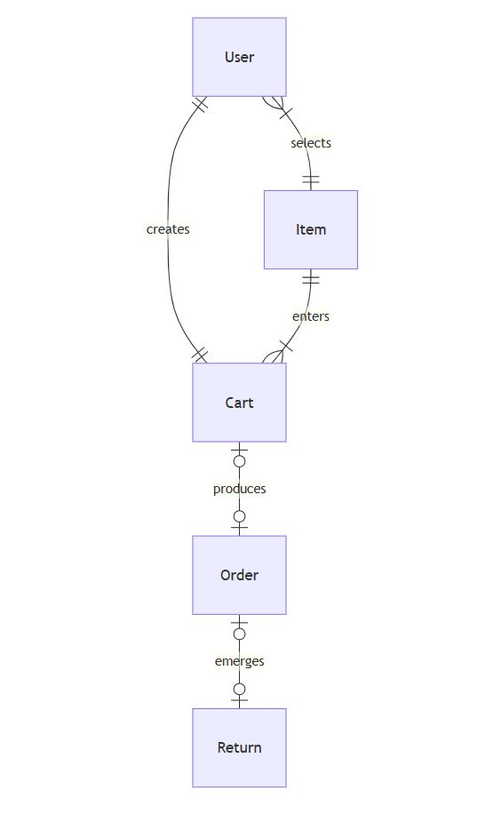

# Design Document

## Scope

The purpose of this database is to enable a comprehensive, rigid organization of items and carts for identifying trends and patterns throughout their existence cycles.

More directly, the internal scope involves:

* Users, which includes basic identifying information about users that created an account
* Items, including the name, type, price, shipping price, description length, number of reviews received, number of product images posted, number of product videos posted, total advertisement, and the date an item was listed
* Carts, which includes basic identifying information about users selecting an item to create a cart
* Orders, which includes basic identifying information about a user's cart that became an order
* Returns, which includes basic identifying information about a user submitting a return after the order was shipped

Elements that remain outside of the scope include items that are produced by different manufacturers and the quantity remaining of each item.

## Functional Requirements

This database supports:

* CRUD operations for users, items, carts, orders, and returns
* Querying for trends and patterns for selected items
* Tracking date durations of carts
* Pinpointing items that were most frequently ordered and discarded

This version of the database does not yet support inventory records or invalid returns.

## Representation

Entities have been integrated into SQLite tables with the following schema.

### Entities

This database includes the following entities:

#### Users

The `users` table includes:

* `id`, which specifies the unique ID of a user as an `INTEGER`. This column has the `PRIMARY KEY` constraint applied.
* `username`, which specifies the username a user has entered for their account as `TEXT`. Each username within the `username` column must be unique; therefore, the `UNIQUE` constraint has been applied.
* `email`, which specifies the user's email address as `TEXT`.
* `address`, which specifies the user's street address as `TEXT`.
* `state`, which specifies the state the user lives in as `TEXT`.
* `date_account_created`, which specifies the date the user created the account as `NUMERIC`. The default value for `date_account_created` is the current date, which is denoted by `DEFAULT CURRENT_DATE`.
* `date_last_login`, which specifies the last date the user logged into the account as `NUMERIC`. The default value for `date_last_login` is the current date, which is denoted by `DEFAULT CURRENT_DATE`.
* `date_recent_login`, which specifies the most recent date the user logged into the account as `NUMERIC`. The default value for `date_recent_login` is the current date, which is denoted by `DEFAULT CURRENT_DATE`.

All columns within the `users` table are required; therefore, the `NOT NULL` constraint has been applied to each column that does not have the `PRIMARY KEY` constraint applied. Additional constraints are not necessary.

#### Items

The `items` table includes:

* `id`, which specifies the unique ID of the item as an `INTEGER`. This column has the `PRIMARY KEY` constraint applied.
* `name`, which refers to the name of the item as `TEXT`.
* `type`, which describes the item category as `TEXT`.
* `price`, which specifies the price of an item as `NUMERIC`.
* `shipping_price`, which specifies the shipping price of an item as `NUMERIC`.
* `description_length`, which refers to the number of words that are within the item's description as an `INTEGER`.
* `reviews`, which refers to the number of reviews an item has received from customers as an `INTEGER`.
* `product_images`, which specifies the number of posted images for the item as an `INTEGER`.
* `product_videos`, which specifies the number of posted videos for the item as an `INTEGER`.
* `advertisement`, which specifies the total amount of money spent on advertisement for the item as `NUMERIC`.
* `date_listed`, which specifies the date the item was listed for sale as `NUMERIC`. The default value for `date_listed` is the current date, which is denoted by `DEFAULT CURRENT_DATE`.

All columns within the `items` table are required; therefore, the `NOT NULL` constraint has been applied to each column that does not have the `PRIMARY KEY` constraint applied.

#### Carts

The `carts` table includes:

* `id`, which specifies the unique ID of the cart as an `INTEGER`. This column has the `PRIMARY KEY` constraint applied.
* `user_id`, which specifies the ID of the user that created the cart as an `INTEGER`. This column has the `FOREIGN KEY` constraint applied, which references the `id` column from the `users` table.
* `item_id`, which specifies the ID of the item within the cart as an `INTEGER`. This column has the `FOREIGN KEY` constraint applied, which references the `id` column from the `items` table.
* `date_created`, which specifies the date a cart was created as `NUMERIC`. The default value for `date_created` is the current date, which is denoted by `DEFAULT CURRENT_DATE`.
* `date_cart_transition`, which specifies the date a cart transitioned into an order or became discarded as `NUMERIC`. The default value for `date_cart_transition` is the current date, which is denoted by `DEFAULT CURRENT_DATE`.
* `became_order`, which specifies the cart becoming an order as an `INTEGER`. A cart that has the integer 1 within the `become_order` column indicates the cart successfully transitioned into an order. A cart that has the integer 0 within the `became_order` column indicates the cart did not become an order.

All columns within the `carts` table are required and have the `NOT NULL` constraint applied to each column that does not have the `PRIMARY KEY` or `FOREIGN KEY` constraint applied.

#### Orders

The `orders` table includes:

* `id`, which specifies the unique ID of the order as an `INTEGER`. This column has the `PRIMARY KEY` constraint applied.
* `cart_id`, which specifies the ID of the cart that has been ordered as an `INTEGER`. This column has the `FOREIGN KEY` constraint applied, which references the `id` from the `carts` table.
* `item_quantity`, which specifies the total quantity ordered as an `INTEGER`.
* `total_amount`, which specifies the total amount of the order as `NUMERIC`. The `total_amount` is calculated by adding the `price` and `shipping_price` from the `items` table together and multiplying the sum by the `item_quantity` from the `orders` table.
* `date_placed`, which specifies the date the order was placed as `NUMERIC`. The default value for `date_placed` is the current date, which is denoted by `DEFAULT CURRENT_DATE`.
* `order_status`, which refers to the status of the order as `TEXT`.
* `date_order_status`, which specifies the date when the `order_status` was updated as `NUMERIC`. The default value for `date_order_status` is the current date, which is denoted by `DEFAULT CURRENT_DATE`.

All columns within the `orders` table are required; therefore, the `NOT NULL` constraint has been applied to each column that does not have the `PRIMARY KEY` or `FOREIGN KEY` constraint applied.

#### Returns

The `returns` table includes:

* `id`, which specifies the unique ID of the return as an `INTEGER`. This column has the `PRIMARY KEY` constraint applied.
* `order_id`, which specifies the ID of the order that submitted a return as an `INTEGER`. This column has the `FOREIGN KEY` constraint applied, which references the `id` from the `orders` table.
* `reason`, which describes the user's input for why the item is being returned as `TEXT`.
* `date_returned`, which specifies the date the item was returned as `NUMERIC`. The default value for `date_returned` is the current date, which is denoted by `DEFAULT CURRENT_DATE`.

All columns within the `returns` table are necessary and have the `NOT NULL` constraint applied to each column that does not have the `PRIMARY KEY` or `FOREIGN KEY` constraint applied.

### Relationships

The entity relationship diagram explains the relationships within the database.

The diagram illustrates:

* Users are able to select one and only one item. Items can be selected by one to many users. It is assumed that each user will be selecting an item.
* An item will enter one to many carts. Each cart will contain one and only one item.
* A user creates one and only one cart. A cart is created by one and only one user. It is assumed that each user will create a cart.
* A cart is associated with 0 to one order. At the same time, an order can be made from 0 to one cart: 0 if a user discards the cart or the system automatically deletes the cart after 7 days, and 1 if the user purchases the item.
* An order is associated with 0 to one return. At the same time, a return can be made from 0 to one order: 0 if the order does not become a return and 1 if the order becomes a return.

## Optimizations

#### Index

The queries provided in the `queries.sql` file demonstrate that users of the database will be frequently accessing the dates orders were placed; therefore, an index has been created for the `date_placed` column to speed up searches.

#### Views

Views named `order_statistics`, `duration_items_listed`, and `items_carts_orders` have been created to simplify the access of frequently combined tables.

## Limitations

The current schema of this database allows users to select one and only one item. Allowing users to select multiple items would necessitate a shift in the entity relationship diagram between users and items to form a many-to-many relationship.